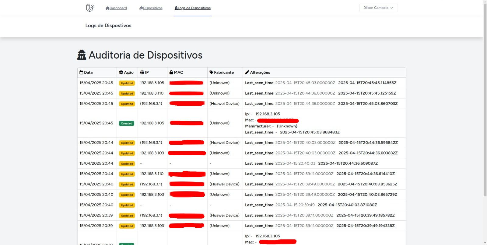
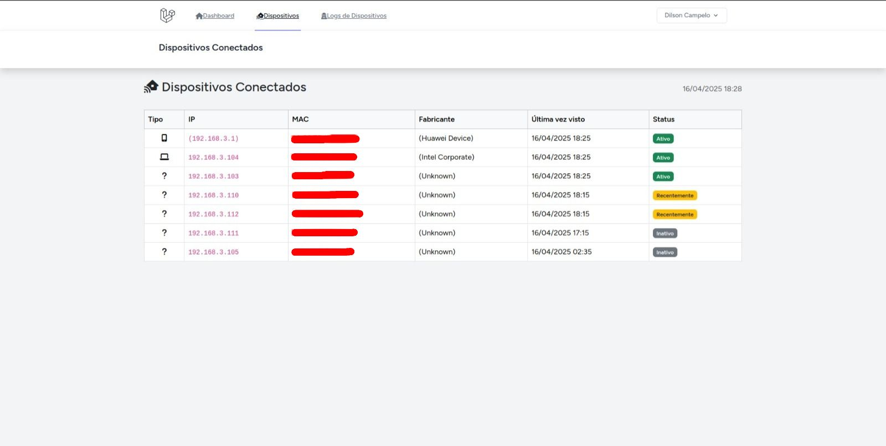
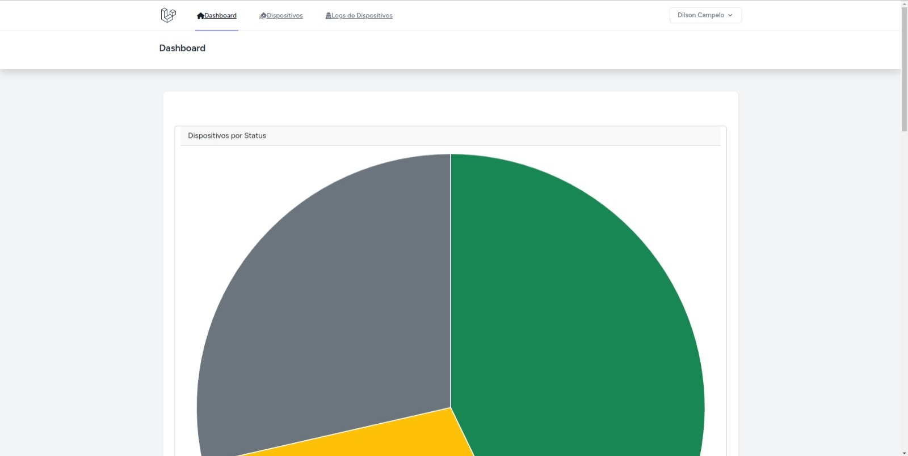

# **Scan Device Net - Dashboard e Dispositivos**

Este projeto é uma aplicação Laravel que gerencia dispositivos que entram e saem da rede, exibindo informações sobre seu status e outras métricas relevantes para um painel de controle. A aplicação usa o Vite para o gerenciamento de assets front-end e MySQL como banco de dados.

Tela de verificação de Logs 


Tela de verificação de dispositivos 


Tela de dashboard com gráficos


## **Pré-requisitos**

Antes de começar, você precisará ter os seguintes programas instalados em sua máquina:

-   PHP 8.3 ou superior
-   Composer
-   Node.js e NPM
-   MySQL 8.0 ou superior

## **Ou Então**

Simplesmente use Docker

-   Docker

## **Instalação**

Siga as etapas abaixo para configurar o ambiente de desenvolvimento local:

### 1. Clone o repositório

Clone o repositório para sua máquina local:

```bash
git clone https://github.com/dilsoncampelo10/scan-device-net
cd scan-device-net

composer install --no-scripts

# Copie o .env de exemplo
cp .env.example .env

# Copie o .env de testes
cp .env.testing.example .env.testing

# Gere a chave da aplicação
php artisan key:generate

npm install

npm run build

# Rodar as migrações do banco de dados
php artisan migrate

# Iniciando servidor
php artisan serve

# Rodando testes
php artisan test
```

Utilizando o Sail do Laravel:

```bash
# Crie um apelido para simplificar o uso do Sail (se necessário)
alias sail='./vendor/bin/sail'

# Subir os containers do Docker
sail up -d

# Instalar dependências do Composer (PHP)
sail composer install

# Rodar as migrações do banco de dados
sail artisan migrate

# Rodar o servidor de desenvolvimento para o front-end (se necessário)
sail npm run dev

# Ou rodar o build do front-end
sail npm run build
```

# Capturar informações trafegadas na rede:

Para isso, existe uma pasta no projeto chamada shellscript, dentro dela tem o arquivo devices.sh
Nele, rodamos o comando nmap e jq, caso não tenha instalado rode:

```bash
sudo apt install jq && sudo apt install nmap
```

Adicionar a permissão de execução ao arquivo:

```bash
chmod +x shellscript/devices.sh

# execute
./shellscript/devices.sh
```

A resposta deve ser semelhante a:
{"status":"ok"}

Caso der algum erro, troque a url da Api no arquivo de acordo  com da sua máquina

Para ficar capturando as redes, vamos adicionar o script em um cron, que fica rodando ele a cada 5 minutos:

```bash
crontab -e

```
### Adicione o conteúdo abaixo ao cron
*/5 * * * * /caminho/para/devices.sh

# Tecnologias Utilizadas

- Backend: Laravel 12

- Frontend: Vite + Blade e ChartJS

- Banco de Dados: MySQL

- Testes: PHPUnit com SQLITE

- Laravel Audits

- Shell Script
